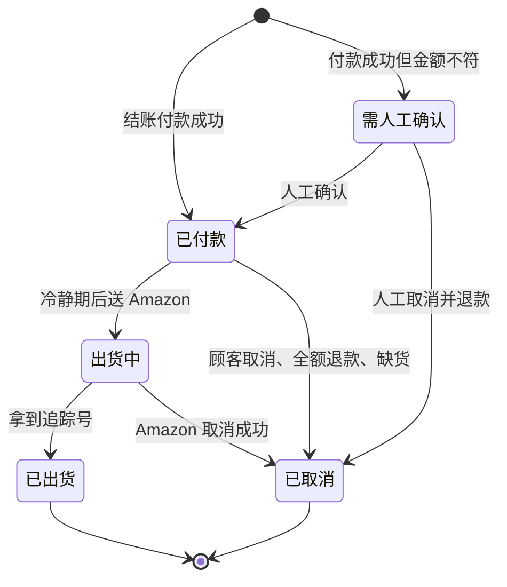

# M4 订单核心：设计规格

| 项目 | 内容 |
|---|---|
| 文件版本 | v0.3，10/6 改为付款成功才成立订单（D36）；v0.2 已审核（格式、深度、冷静期 1 小时） |
| 日期 | 2026-10-06 |
| 上层文件 | `docs/commerce-plan.md`、`docs/design/scenarios.md` |
| 对应情境 | C11、D1、D4、D5、D7、D8、D10、D11、D13、D17、E4–E7、F1–F5、G5、G9、I2 |

---

## 0. 摘要

订单核心是整个系统的骨干：记录「谁买了什么、付了多少、寄到哪里」，并且是**唯一能改变订单状态的地方**。付款、出货、售后等模块做完自己的事以后，都要回报给订单核心，由它依照本规格的状态转换表决定订单能不能往下走。

这样做的目的：所有「订单现在到底在哪个阶段」「这个动作现在能不能做」的判断都集中在一处，不会出现付款模块以为已取消、出货模块却照样送单的情况。

**订单从付款成功开始（D36）。** 还没付款的叫「结账」，由 M3 管理，不算订单，也不出现在订单列表。付款成功时，订单核心用结账里已检查、已锁定的资料建立订单。这跟 Shopify 的做法一样。

---

## 1. 负责与不负责

| 负责 | 不负责（由谁负责） |
|---|---|
| 订单编号、订单资料的保存 | 价格、运费、税怎么算（M2 商品与价格） |
| 订单状态与转换规则 | 栏位输入检查与地址验证（M3 购物车与结账） |
| 冻结条件（哪些订单不能出货） | 收款、退款、拒付的处理（M5 付款） |
| 操作纪录：谁、何时、做了什么 | 送 Amazon、追踪同步（M6 出货） |
| 提供订单的统一视图给前台、后台、通知 | 取消、改地址、退货流程的协调（M7 售后） |
| 用付款成功的结账建立订单 | 寄信（M8 通知） |
| | 还没付款的结账：保存、沿用、24 小时失效（M3 购物车与结账） |

**原则**：其他模块不能直接改订单状态，只能呼叫订单核心定义好的动作（例如「付款成功」「出货完成」）。订单核心检查这个动作在目前状态下合不合法，不合法就拒绝并留纪录。

---

## 2. 订单资料

### 2.1 栏位与规则

栏位的输入检查由 M3 在前端和后端各做一次；订单核心只接受检查通过的资料，并在保存时再确认一次必填和格式。

| 栏位 | 必填 | 规则 | 备注 |
|---|---|---|---|
| 订单编号 | 系统产生 | `APGO-US-` 加 12 码随机字元，不可猜。结账开始时就配好，付款成功后成为订单编号 | 沿用现有格式。付款服务那边的订单参考号也是这个编号，客服可以直接用它在 Airwallex、PayPal 后台查 |
| Email | 是 | 格式正确，存成小写，最长 254 字元 | 拼错提示由 M3 做（C3） |
| 电话 | 是 | 美国 10 码电话，统一存成 `+1XXXXXXXXXX` | 新增（C9） |
| 名、姓 | 是 | 只收英文字母、空格和常见符号；长度上限对齐 Amazon 出货单 | 上限数字在 M6 规格确认（C8） |
| 地址一 | 是 | 同上；不能是 PO Box 或军邮 | C5 |
| 地址二 | 否 | 公寓、楼层、门牌 | |
| 城市 | 是 | 同上 | |
| 州 | 是 | 只能是 48 州加 DC | C4 |
| ZIP | 是 | 5 码或 5+4 码，而且要跟州对得上 | C6 |
| 地址验证结果 | 系统 | 验证状态、标准化后的地址、顾客是否接受建议 | 新增（C7） |
| 营销同意 | 否 | 预设不同意 | C10 |
| 品项 | 是 | 每项 1–10 件，只能是上架中的商品；组合包要记录展开后的单品 | A6 |
| 金额 | 系统 | 小计、运费、税、总额、币别 USD，由 M2 计算，下单时锁定 | 之后改价不影响已建立的订单 |
| 付款方式与付款单编号 | 系统 | 付款成功的那一张：Airwallex 的 PaymentIntent 或 PayPal 订单编号 | 同一笔结账作废的付款单留在结账纪录 |
| 时间 | 系统 | 结账开始、付款（订单成立）、更新、取消 | |
| 取消原因 | 取消时必填 | 固定选项：顾客要求、缺货、全额退款、拒付、人工取消（需人工确认的订单）、其他 | 新增 |

### 2.2 金额锁定

结账开始时锁定金额（M3 第 5 节），付款成功时订单沿用这个金额。之后商品改价、运费改了，都不影响已成立的订单。结账途中重新报价的结果不同时（C12），由 M3 更新同一笔结账并请顾客重新确认，旧的付款单作废；已成立订单的金额永远不改。

---

## 3. 状态与转换

### 3.1 主状态

订单从付款成功开始，所以没有「待付款」状态（D36）。还没付款的结账由 M3 管理。

| 状态 | 意思 | 顾客在订单页看到 | 可以做的事 |
|---|---|---|---|
| 需人工确认 `review` | 付款成功，但金额或币别跟结账锁定的不符 | 处理中 | 人工确认或取消退款 |
| 已付款 `paid` | 付款成功，在冷静期内或等待送出货 | 已收到订单 | 取消、改地址；冷静期结束后送出货 |
| 出货中 `fulfilling` | 已送 Amazon，还没拿到追踪号 | 准备出货 | 尝试取消 |
| 已出货 `shipped` | 已拿到追踪号 | 已出货，附追踪号 | 退货（由 M7 处理） |
| 已取消 `cancelled` | 订单终止 | 已取消 | 无 |

退款、拒付、退货不另外占用主状态，而是另外记录（见 3.4），因为它们可能发生在任何阶段，也可能只退一部分。

### 3.2 状态图

### 3.3 转换表

只有表上列出的转换是合法的。其他任何转换（例如「已出货 → 已付款」）都会被拒绝并留纪录。

| # | 从 | 到 | 触发 | 条件 | 后续动作 | 情境 |
|---|---|---|---|---|---|---|
| T1 | （结账） | 已付款 | 付款服务（Airwallex 或 PayPal）确认付款成功 | 金额、币别相符 | 用结账资料建立订单；确认信、团队通知、Meta 和 GA4 的购买事件；冷静期结束后自动送出货 | D1、D4、D5 |
| T2 | （结账） | 需人工确认 | 付款成功 | 金额或币别不符 | 建立订单并通知团队；不出货 | D7 |
| T5 | 需人工确认 | 已付款 | 后台人工确认 | 确认者写下原因 | 同 T1 的后续动作，而且只发生一次 | D7 |
| T6 | 需人工确认 | 已取消 | 后台人工取消 | 无 | 全额退款（M5）、通知顾客 | D7 |
| T7 | 已付款 | 出货中 | 冷静期结束，送 Amazon 成功 | 没有冻结条件（见 3.4） | 无 | F1 |
| T8 | 已付款 | 已取消 | 顾客要求（后台操作）、全额退款、拒付输掉、缺货超过 3 天 | 无 | 如果还没退款就全额退款；通知顾客 | E4、F2、G9 |
| T9 | 出货中 | 已出货 | 出货模块拿到追踪号 | 无 | 出货通知 | F5 |
| T10 | 出货中 | 已取消 | Amazon 取消成功（顾客要求，或缺货超过 3 天） | 无 | 全额退款、通知顾客 | E5、F2 |

T3、T4（未付款逾时取消、付款单无法建立）在 v0.3 移除：没付款就没有订单，这两种情况改由 M3 的结账处理（D36）。编号不重用，其他规格引用的 T 编号不变。

### 3.4 不改变主状态、但会影响订单的事件

| 事件 | 处理 | 情境 |
|---|---|---|
| 部分退款 | 记录退款；如果还没出货，冻结出货并通知团队 | G5、F4 |
| 全额退款（还没出货） | 走 T8 或 T10，订单改为已取消 | G9、F4 |
| 全额退款（已出货） | 记录退款，订单维持已出货；售后纪录由 M7 处理 | G1、G3 |
| 顾客申请拒付 | 记录拒付；如果还没出货，冻结出货并通知团队 | D10、F4 |
| 拒付结束：我们赢 | 解除冻结 | D10 |
| 拒付结束：我们输 | 视同全额退款 | D10 |
| 结账失效后才收到付款成功 | 照样建立订单（金额要相符，不符就进需人工确认），并通知团队留意；顾客收到一般的确认信 | D8 |
| 同一笔结账第二次付款成功（已经有订单） | 自动全额退还后到的那笔，通知顾客「重复的付款已退回」，并通知团队 | C11 |

### 3.5 冻结条件

符合任一条件的订单，出货模块不能送单：

- 状态是需人工确认
- 有退款登记（失败的退款除外）
- 有进行中的拒付

### 3.6 冷静期

付款成功后，先等一段时间才自动送 Amazon（D19 已决定自动送单）。这段时间内，顾客可以请客服取消或改地址，而且不必向 Amazon 取消。

**冷静期为 1 小时（10/6 确认，D23）。** 没有冷静期的话，付款后几秒内就送出，顾客几乎没有机会取消或改地址，这些要求都会变成「向 Amazon 取消，不一定成功」或「只能等收到再退货」。

### 3.7 改地址

- 只有「已付款」而且在冷静期内可以改。改过的地址要重新通过地址验证。
- 送 Amazon 之后不能改（Amazon 不允许修改已送出的出货单）。顾客坚持要改，就走取消（T10，不保证成功）或送达后处理（E7）。
- 每次修改都写入操作纪录，包含修改前后的地址。

---

## 4. 跟其他模块的介面

### 4.1 订单核心接收的动作

| 来自 | 动作 | 对应转换 |
|---|---|---|
| M3 购物车与结账 | 结账资料（已检查、金额已锁定） | 付款成功时据此建立订单 |
| M5 付款 | 付款成功（附结账编号）、金额不符、同一笔结账重复付款 | T1、T2、3.4 |
| M5 付款 | 退款登记、退款结果、拒付开启或结束 | 3.4 |
| M6 出货 | 送单成功、拿到追踪号、Amazon 取消成功、Amazon 无法出货 | T7、T9、T10、F2 |
| M7 售后（含后台操作） | 取消订单、改地址 | T8、T10、3.7 |
| M9 后台 | 人工确认、人工取消 | T5、T6 |
| 排程 | 冷静期到期检查 | T7 |

### 4.2 订单核心提供的资讯

| 给谁 | 内容 |
|---|---|
| 前台订单页（M1） | 订单状态、品项、金额、遮蔽过的 email、追踪号；不显示完整地址。还没付款的结账显示「付款未完成」（资料来自 M3） |
| 后台（M9） | 完整资料、退款与拒付纪录、冻结原因、操作纪录 |
| 出货（M6） | 这张订单现在能不能送出货（冻结条件、冷静期） |
| 通知（M8） | 状态改变的事件，由 M8 决定要不要寄信 |
| 追踪与分析（M10） | 付款成功、退款事件 |

---

## 5. 例外处理

| 情况 | 处理 |
|---|---|
| 同一个事件重复送达，或同时处理两次 | 状态更新附带「目前状态必须是某某」的条件，只有第一次会成功；后续动作（寄信、通知、广告事件）因此只发生一次（沿用现有做法） |
| 事件顺序颠倒（例如退款通知比付款通知先到） | 先把事件记下来，再向付款服务查询最新状态后处理 |
| 结账失效后才付款成功、同一笔结账重复付款 | 见 3.4 |
| 外部服务暂时失败（Airwallex、PayPal、Amazon） | 订单状态不变，由排程重试；超过重试次数就通知团队 |
| 我们的数据库写入失败 | 付款服务会重送通知；另外每天对帐（M5），找出「付款成功但订单不是已付款」的情况 |
| 不合法的转换 | 拒绝，写入操作纪录，并通知团队 |

---

## 6. 后台与通知

**后台订单列表的分类**：需人工确认、已付款（冷静期中）、出货中、已出货、已取消；另外可以筛选「有退款」「有拒付」「冻结中」。还没付款的结账不在订单列表，放在「未完成结账」页（M9）。

**后台动作**：确认需人工确认的订单、取消订单（会连带全额退款）、在冷静期内改地址、查看操作纪录。每个动作都要求填写原因。

**操作纪录**：每次状态改变或人工操作都写一笔：时间、操作人（Cloudflare Access 的登录身份；系统自动的写「系统」）、动作、改变前后的状态、原因。现在的纪录里操作人一律是「admin」，要改成真实身份（I2）。

**团队通知**：需人工确认、拒付开启、不合法的转换、结账失效后才付款、重复付款已自动退还、重试多次仍失败。

---

## 7. 验收测试

| # | 测试 | 情境 |
|---|---|---|
| M4-01 | 付款成功后订单变为已付款；确认信、团队通知、购买事件都只发生一次，即使通知重复送达 | D1、D4、D5 |
| M4-02 | 金额不符时订单进入需人工确认，不会送出货，并通知团队 | D7 |
| M4-03 | 付款成功前不会产生订单，订单列表也看不到；付款成功后才建立订单，订单编号就是结账编号，金额是结账锁定的金额 | D1、C11 |
| M4-04 | 结账失效后才收到付款成功：照样建立订单（金额不符就进需人工确认），并通知团队 | D8 |
| M4-05 | 冷静期内顾客取消：订单取消、全额退款，不会送 Amazon | E4 |
| M4-06 | 已送 Amazon 后取消：向 Amazon 取消；成功就取消订单并退款，失败就维持出货中并通知团队 | E5 |
| M4-07 | 已出货的订单不能取消，后台只提供退货选项 | E5、G1 |
| M4-08 | 还没出货就全额退款：订单自动取消，不会送出货 | G9、F4 |
| M4-09 | 部分退款或拒付开启：冻结出货并通知团队；拒付赢了就解除冻结 | G5、D10、F4 |
| M4-10 | 冷静期内可以改地址，而且要重新通过验证；送 Amazon 之后不能改 | E6、E7 |
| M4-11 | 转换表以外的转换会被拒绝、留下纪录并通知团队 | — |
| M4-12 | 每次状态改变和人工操作都有纪录，操作人是真实身份 | I2 |
| M4-13 | 事件顺序颠倒时，最后的状态仍然正确 | D5 |
| M4-14 | Amazon 无法出货超过 3 天：订单自动取消、全额退款、通知顾客 | F2 |
| M4-15 | 已建立订单的金额不会因为之后改价而改变 | C12、A5 |

---

## 8. 跟现有代码的差距

以 shopapgo `codex/us-commerce` 分支为准。

| 项目 | 现在 | 要做的 |
|---|---|---|
| 订单成立的时间点 | ✗ 一按付款就建立订单（待付款） | 改成付款成功才成立（D36）。实作上可以沿用同一张资料表：付款前的纪录当作结账，订单列表、报表、通知只算付款成功的。正式环境现有 39 张待付款纪录，切换后视为已失效的结账 |
| 主状态 | 只有待付款、已付款、需人工确认、已取消；出货进度分散在出货的两张表里 | 去掉待付款（改为结账）；加入出货中、已出货，订单状态存在一个栏位，出货细节仍留在出货模块的表 |
| 付款成功只处理一次 | ✓ 已有 | 沿用 |
| 金额不符进入需人工确认 | ✓ 已有 | 加上团队通知 |
| 退款冻结出货 | ✓ 已有 | 加上拒付冻结；全额退款自动取消 |
| 未完成结账失效 | ✗ 待付款纪录永远挂着 | 改由 M3 处理：24 小时失效，先作废 Airwallex 和 PayPal 的付款单 |
| 取消订单、改地址 | ✗ 后台没有这些动作 | 新增后台动作和转换检查 |
| 冷静期 | ✗ | 新增，1 小时 |
| 操作纪录 | △ 有纪录，但操作人一律是「admin」 | 改用 Cloudflare Access 的登录身份 |
| 取消原因、电话、地址验证结果 | ✗ | 新增栏位，用数据库迁移文件加入 |

---

## 9. 决定纪录

| # | 问题 | 决定 |
|---|---|---|
| 1 | 付款后的冷静期多长？ | 1 小时（10/6，D23） |
| 2 | 订单什么时候成立？ | 付款成功才成立；没付款的是「未完成结账」，跟 Shopify 一样（10/6，D36） |
| 3 | 结账失效后才付款成功怎么办？ | 照样建立订单并通知团队，不自动退款。Shopify、WooCommerce 都接受晚到的付款（10/6，D36；取代原本「自动全额退款」的做法） |
