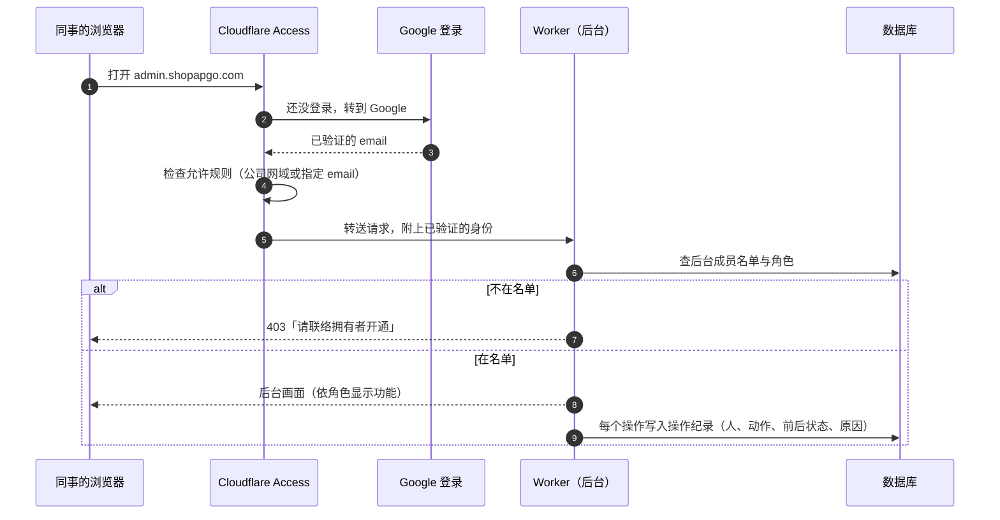
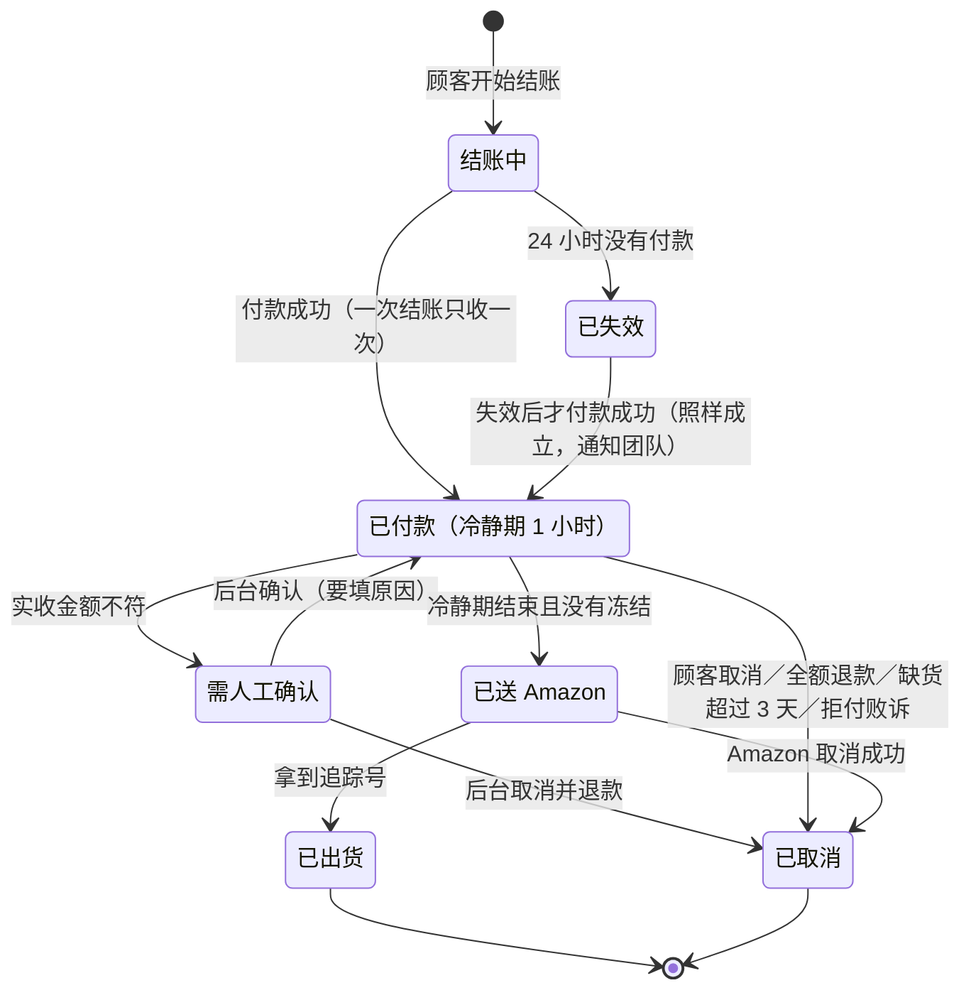
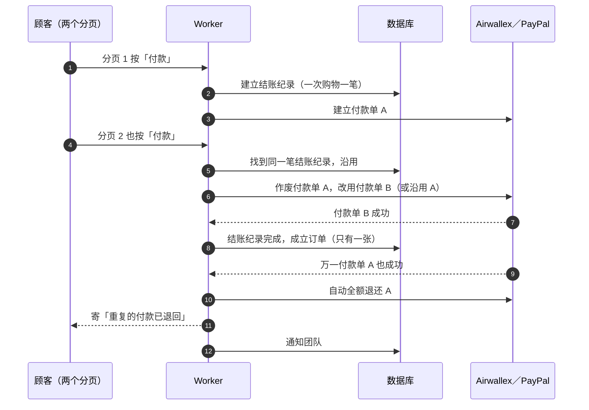
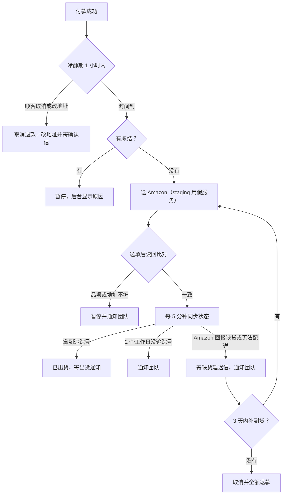
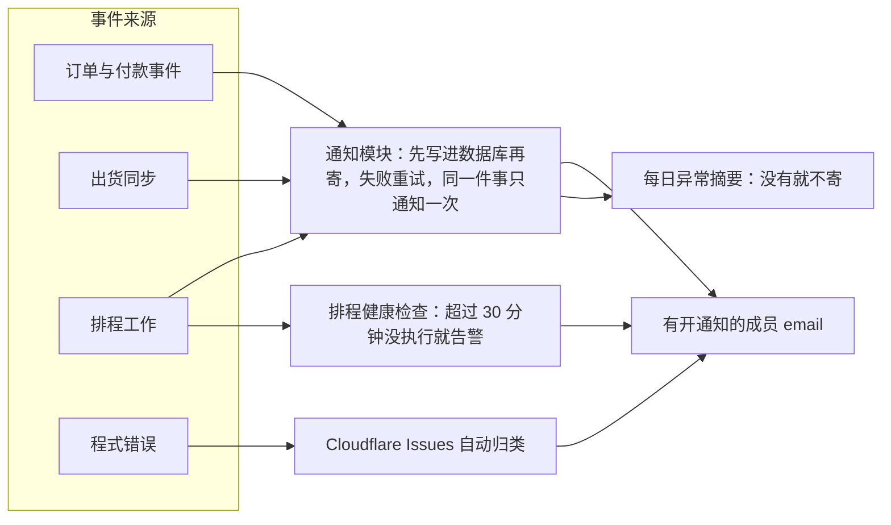
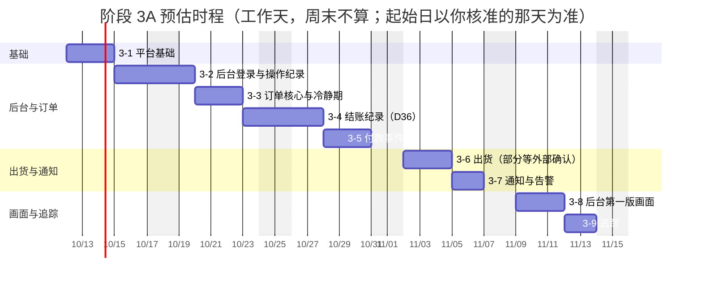

# 阶段 3 计划：后台与营运（含上线前必须补齐的订单流程）

> 状态：草稿，等你审核（2026-10-09）。审核通过后，`docs/commerce-plan.md` 第 6 章的阶段 3 改成本文件的范围与时程。
> 依据：逐一比对 12 个模块规格（`docs/design/modules/`）、情境清单（`docs/design/scenarios.md`）与目前的程式。

---

## 0. 一页摘要

**原企划的阶段 3**只列了四件事：后台改用 Cloudflare Access 登录、后台第一版画面（D34）、正式环境的出货／寄信／通知设定、组合包，估约 5–8 个工作天。

**逐一比对规格和程式后发现**，订单流程里有不少规格写好、但还没做的部分。其中几项在切换上线后会直接造成损失：

| 风险 | 现在的程式 | 后果 | 规格 |
|---|---|---|---|
| 顾客每按一次付款就建一张新订单 | 没有「一次结账只收一次钱」 | 两个分页都付款成功，就会**扣两次款、出两次货** | D36、M5 §3.4 |
| 付款当下就送 Amazon | 没有 1 小时冷静期 | 顾客马上要取消或改地址时已经来不及 | D19、D23 |
| 拒付（chargeback）完全没有处理 | 不记录、不冻结 | 顾客申请拒付后，系统照样出货 | D10、D18 |
| PayPal 退款不会被记录 | 只处理 PayPal 收款事件 | 在 PayPal 退款后，系统仍可能送单出货 | D17 |
| staging 打开自动送单会真的出货 | Amazon 没有测试环境 | 测试时会寄出真实包裹 | M6 §9 |
| 后台是共用密码 | 操作纪录一律记成「admin」 | 不知道是谁做的；同事离职要换密码 | D33、M9 |
| 没有告警 | 送单失败、Amazon 拒单只写在纪录里 | 出问题没人知道 | M8 §3、M12 §5 |
| 没付款的结账永久保留个人资料 | 没有 24 小时失效、30 天删除 | 违反 D36 和隐私政策草稿 | D36、M3 §5 |

**建议**：阶段 3 分成两段，用业界常见的「上线必备／上线后补强」分级。

- **3A 上线必备（P0，切换前完成）**：会造成金钱损失、出错货、违反隐私，或没办法安全营运的项目。约 **20–24 个工作天**，分 9 个 PR。
- **3B 上线后补强（P1，切换后 2–4 周）**：提升效率的项目，期间有写明的人工替代做法。约 **8–10 个工作天**。

**需要你决定的事**有 7 件，见第 8 章，每件都附推荐做法。

---

## 1. 分级原则

| 等级 | 定义 | 例子 |
|---|---|---|
| **P0 上线必备** | 不做就会：多扣钱或少收钱、出错货或重复出货、违反隐私或法规、出问题没人知道、没办法回退 | 一次结账只收一次钱、冷静期、拒付冻结、告警、后台登录到人、备份还原演练 |
| **P1 上线后补强** | 提升效率或体验；上线初期订单量小，可以用写明的人工流程替代 | 售后案件系统、完整报表与汇出、顾客资料汇出删除画面 |
| **P2 之后** | 等决定或等量大再做 | 组合包（O9 还没决定）、只读角色 |

判断依据是「如果切换当天就上线，缺这一项会不会出事」，不是「规格上有没有写」。

---

## 2. 现况与缺口（依模块）

| 模块 | 已经有 | 缺（P0） | 缺（P1 之后） |
|---|---|---|---|
| M3 未完成结账（D36） | 未付款的结账目前存成 `pending` 订单 | 结账纪录、只收一次钱、24 小时失效并作废付款单、30 天删除个人资料、后台「未完成结账」页 | — |
| M4 订单核心 | 付款成功只成立一次；退款时不出货 | 统一的状态转换、1 小时冷静期、后台取消、冷静期内改地址、需人工确认订单的确认或取消、拒付冻结、全额退款即取消、操作纪录记到人（含原因、前后状态）、不合法转换告警 | — |
| M5 付款 | Airwallex 收款、付款失败、退款纪录与退款信 | PayPal 退款、撤销、拒绝事件；拒付纪录与冻结（两家）；每日对帐抓漏 | 拒付佐证资料一键汇出、每月对帐 CSV、GA4 退款事件 |
| M6 出货 | 送单、防重复、重试、追踪同步、连线检查 | 冷静期后才送单、Hold 测试单（D26）、送单后自动比对、库存与缺货门槛、缺货延迟处理、2 个工作日未出货告警、取消送单按钮、staging 假 Amazon 服务 | 多包裹完整显示、退回寄件人处理、补寄、退货收件 |
| M7 售后 | 联络表单 | — | 整个案件系统（用人工流程过渡，见第 5 章） |
| M8 通知 | 寄信佇列、重试、退信停寄；4 种顾客信、2 种团队信 | 4 种顾客信、11 种团队信（第 4.7 节）、成员通知设定、寄件网域（O8） | 售后相关的 8 种顾客信 |
| M9 后台 | 订单列表与详情、出货、送单、寄信重试、联络讯息 | Access 登录与成员名单、操作纪录画面、首页总览、库存页、内部备注、停售开关、拒付筛选、未完成结账页 | 顾客名单与顾客页、报表、CSV 汇出、付款查询画面 |
| M10 追踪 | 商店事件已推到 dataLayer；Meta 购买事件去重 | 正式环境载入 GTM（D40）、GA4 电商格式、只留一份 Pixel、移除 AmazonClick、GPC 隐私讯号（O7） | GA4 退款事件 |
| M12 平台 | CI 跑所有测试；webhook 签章；联络表单限速 | 数据库迁移档、还原点与演练、回退演练、正式环境只从 CI 部署、结账 API 限速、错误告警、排程健康检查 | 密钥外泄处理文件、部署后比对线上设定 |

---

## 3. 架构与流程图

### 3.1 后台登录（Cloudflare Access 加后台成员名单）

业界常见的「两层」做法：Cloudflare Access 在最外层确认「你是谁」（Google 登录），后台自己的成员名单再决定「你能做什么」。同事离职时，拥有者在后台移除即立即失效，不用换任何密码。

- 身份由 Cloudflare 平台验证后交给 Worker（`ctx.access`，2026 年 8 月起提供），Worker 再比对 Access 应用的识别码（AUD），不是从网址或表单读身份。
- 角色两种：**拥有者**（全部，加上成员与设定）和**成员**（日常操作）。最后一个拥有者不能被移除（M9 §1）。
- 共用的 email 加密码登录在切换后停用；脚本用的 `ADMIN_TOKEN` 只留给排程或移除（O10）。

### 3.2 订单状态（含冷静期与冻结）

- **冻结**（不送单、不出货）：需人工确认中、有任何没失败的退款、或拒付处理中（M4 §3.5）。
- **只有订单核心能改状态**：所有模块都透过同一组动作改订单，表外的转换一律拒绝、记录并通知团队（M4 §3.3）。
- **冷静期内**可以取消（全额退款）或改地址（重新验证地址、记录改前改后）。

### 3.3 一次结账只收一次钱

- 结账纪录 24 小时没付款就失效：先向付款服务确认状态，再作废付款单（处理中的不作废）。
- 个人资料 30 天后删除，只留统计用的金额与品项（M3 §5）。
- 正式数据库里现有的 39 笔 `pending` 订单，迁移时一律当成已失效。

### 3.4 出货流程（冷静期、送单比对、缺货）

- **Hold 测试单（D26）**：切换当天在正式环境建一张 Hold 单（Amazon 不会真的出货），确认 Amazon 接受后取消，证明正式连线可用。需要先确认公司的 amazon-spapi-mcp 服务支援 Hold（第 8 章 外部依赖）。
- **库存**：每 15 分钟读一次 Amazon 可售库存；低于 5 件时，商品页显示缺货、购物车不能结账（D25），并通知团队。
- **staging 假 Amazon 服务**：只在 staging 启用，模拟「接单 → 出货 → 追踪号」和「缺货」，正式环境一律拒绝启用（有测试守着）。

### 3.5 通知与告警流向

- 团队通知寄给「在后台开了通知的成员」，至少一个人要开着，预设是拥有者（M8、I12）。
- 程式错误用 Cloudflare 内建的 Workers Issues 自动归类并通知，不用另外接第三方服务。

---

## 4. 工作项目（3A 上线必备）

每一项都写：做什么、细节决定、验收（规格里的测试编号）。估计是工作天，含测试与 staging 部署检查。

### 4.1 平台基础（PR 3-1，约 2.5 天，其他项目都依赖它）

- **数据库迁移档**：建立 `commerce/migrations/`，每次变更一个编号档，CI 检查只能新增（见第 8 章 决定 4）。正式环境套用前先记录还原点。
- **还原演练**：在 staging 用 D1 内建的 Time Travel 还原到指定时间点，写成步骤文件（J3、M12-05）。
- **回退演练**：在 staging 把 Worker 退回上一版，目标 10 分钟内完成（J2、M12-04、上线验收 G14）。
- **正式环境只从 CI 部署**：GitHub Actions 加部署工作。staging 在 `main` 更新后自动部署；正式环境要你在 GitHub 按核准才部署（M12-01/02）。本机不再部署正式环境。
- **staging 假 Amazon 服务**：在 staging 模拟送单与出货，正式环境不能启用。
- **结账 API 限速**：同一来源每分钟上限，超过回 429，防止机器人刷单或盗卡测试（C14、J4、M12-06）。
- **错误告警**：打开 Workers Issues 并通知到你的信箱；排程每次执行留下心跳，超过 30 分钟没执行就告警。
- **排程改成每 5 分钟**：冷静期后送单、状态同步比较及时（Cloudflare 排程不另外收费）。

### 4.2 后台登录与操作纪录（PR 3-2，约 2.5 天）

- Cloudflare Access 保护 `admin.shopapgo.com` 和 `admin-staging.shopapgo.com`，用 Google 登录；没有 Google 帐号的人可以用 email 一次性密码（M9 §1）。
- 新资料表：后台成员（email、角色、加入者、时间）、全站操作纪录（时间、人、动作、对象、前后状态、原因）。
- 后台「成员」页：只有拥有者能加人、改角色、移除；最后一个拥有者不能移除；每次变动写进纪录并通知拥有者（I6）。
- 现有的出货、送单、寄信重试等操作改成记录真实身份。
- 后台「操作纪录」页：依时间和成员筛选（I11）。
- 验收：M9-01、M9-02、M9-09、M9-10、M9-11、M9-19。

### 4.3 订单核心与冷静期（PR 3-3，约 3 天）

- 一个统一的状态转换函式加转换表；所有改订单的地方都改用它；表外的转换拒绝、记录并通知团队。
- 付款成功后 1 小时冷静期，期满且没冻结才送单（取代现在付款当下送单）。
- 后台动作（都要填原因、写进纪录）：
  - 需人工确认订单：确认（照常成立）或取消（退款在付款服务后台执行，D24）。
  - 取消订单：还没送 Amazon 就直接取消；已送 Amazon 就先向 Amazon 取消，成功才取消订单（E4、E5）。取消原因用固定选项（M4 §2.1）。
  - 冷静期内改地址：重新做地址验证，记录改前改后，寄确认信（E6）。
- 冻结：需人工确认、有退款、拒付中，都不送单不出货（F4）。
- 出货前全额退款 → 订单自动取消。
- 验收：M4-02、M4-05 到 M4-13、M4-15（M4-03、M4-04 在 PR 3-4；M4-14 缺货自动取消在 3B）。

### 4.4 结账纪录（D36，PR 3-4，约 3 天）

- 新资料表「结账纪录」：一次购物一笔，重试和换付款方式都沿用；订单编号就是结账编号，也是付款服务上的商户单号。
- 只有付款成功才成立订单；第二笔成功的付款自动全额退还，寄信给顾客并通知团队。
- 排程：24 小时没付款就失效（先向付款服务确认，再作废付款单）；失效后才付款成功，照样成立订单并通知团队。
- 排程：30 天后删除结账纪录里的个人资料；广告归因的 IP 和浏览器资讯同样期限删除；联络讯息的保存期限依隐私政策定稿（M11 待律师确认）。
- 后台「未完成结账」页：email、品项、金额、建立时间、付款失败原因、状态；可以用 email 搜寻；不寄提醒信（I14）。
- 验收：M3-13、M3-18、M4-03、M4-04、M5-08、M9-22。

### 4.5 付款事件（PR 3-5，约 2.5 天）

- PayPal：处理退款（REFUNDED）、撤销（REVERSED）、拒绝（DENIED）事件；退款纪录改成两家通用（D17）。
- 拒付：新资料表记录付款服务、原因、金额、回应期限；收到就冻结订单、通知团队，期限前 3 天再提醒一次；胜诉解除冻结，败诉当成全额退款（D10、D18）。
- 后台订单列表加「拒付中」筛选，依回应期限排序（I13）。
- 每日对帐：比对「付款服务显示已收款」和「系统订单已付款」，有差异就通知团队（D11、D15）。
- 验收：M5-06、M5-10、M5-12、M5-13。

### 4.6 出货（PR 3-6，约 3 天，部分要等外部确认）

- 冷静期后由排程送单（4.3 已改流程，这里接上 Amazon）。
- 送单后读回 Amazon 的订单，比对品项、数量、地址；不符就暂停并通知团队（D26）。
- Hold 测试单：后台加一个只有拥有者能用的「建立 Hold 测试单」按钮，切换当天用（G15）。
- 库存：每 15 分钟读 Amazon 可售与在途数量，存成快照；低于 5 件时商品页显示缺货、不能加入购物车与结账，并通知团队（A3、B3、D25）。
- 缺货：Amazon 回报缺货或无法配送时，寄缺货延迟信、通知团队；后台显示已延迟几天，并提供「取消并退款」按钮；第 3 天再提醒一次（D18、F2）。3 天后自动退款放在 P1（第 8 章 决定 7）。
- 付款后 2 个工作日还没有追踪号：通知团队（F7）。
- 后台「取消送单」按钮（接到 4.3 的取消）。
- 后台「库存」页：各商品的可售、在途、门槛与更新时间（I9）。
- 验收：M6-01、M6-02、M6-06、M6-07、M6-08、M6-09、M6-15、M6-16、M9-17。

### 4.7 通知与告警（PR 3-7，约 2 天）

- 新增顾客信（4 种）：取消确认、改地址确认、缺货延迟通知、重复的付款已退回。现有的 4 种照旧（订单确认、出货通知、退款完成、退款失败）。
- 新增团队信（11 种）：需人工确认、重复付款已自动退还、结账失效后才付款成功、送单失败、Amazon 拒单或缺货、出货延迟、拒付（含期限前 3 天提醒）、库存低于门槛、地址验证服务连不上、不合法的状态转换、每日异常摘要。
- 后台每个成员可以设定要不要收团队通知，至少一个人要开着（I12）。
- 寄件网域（O8，第 8 章 决定 2）：设定 SPF、DKIM，加上 DMARC（业界标准，Gmail 和 Yahoo 对寄件者的要求）。
- 验收：M8-01（售后相关的信除外）、M8-02 到 M8-04、M8-06 到 M8-10、M9-20（M8-05 多包裹在 3B）。

### 4.8 后台第一版画面（PR 3-8，约 3 天）

- **首页**：今天与本月营收和订单数；待办数量：待出货、送单失败、退款中、拒付中、退信、缺货（I5、I8 的首页部分）。数字不含未完成结账。
- **内部备注**：订单上留备注，记录写的人和时间，顾客看不到（I10）。顾客页上的备注放在 3B。
- **停售开关**：拥有者可以一键停售某个商品，立即生效；购物车里的该商品不能结账（A4、M2-04）。
- 已在其他 PR 完成的画面：成员、操作纪录（3-2）、未完成结账（3-4）、拒付筛选（3-5）、库存（3-6）。
- 移除订单列表里的「pending」分页（D36 之后不再有未付款订单）。
- 验收：M9-04、M9-07、M9-12、M9-18（订单备注；顾客页备注在 3B）。

### 4.9 追踪（PR 3-9，约 2 天）

- 正式环境的网站建置载入 D40 那一套 GTM（GTM-TD5NTFH9 → GA4 G-YM10YMKE30）；测试站一律不载入。
- 商店事件改成 GA4 电商格式：`view_item`、`add_to_cart`、`begin_checkout`、`purchase` 都带 `ecommerce` 物件（品项、数量、金额、币别；购买带订单编号）；修正 `begin_checkout` 和 `view_cart` 的品项格式。
- 只留一份 Meta Pixel 程式：品牌页和商店页共用，避免事件送到不同的 Pixel；移除 `AmazonClick` 和 `amazon_referral_click`（M10 §2）。
- GPC 隐私讯号（O7，等律师意见，第 8 章 决定 5）：做成开关，预设照隐私选择草稿的建议，浏览器送出 GPC 时不载入 Pixel、不送 CAPI。
- 验收：M10-01、M10-02、M10-07、M10-08；上线验收 G9 在切换当天用 GTM 预览和 Meta 测试工具实测。

---

## 5. 3B 上线后补强（P1）与过渡期的人工做法

| 项目 | 内容 | 上线到完成之间的人工做法 |
|---|---|---|
| 售后案件（M7 全部） | 案件列表、状态、逾期提醒、退货规则计算、补寄、8 种售后顾客信 | 顾客写信到 services@apgo.com.tw；在订单备注记录处理进度；取消、改地址、退款用 3A 的后台按钮和付款服务后台；退货与补寄在 Seller Central 处理 |
| 顾客名单与顾客页 | 订单数、累计消费、营销同意、所有订单与备注 | 用订单搜寻（email）查同一位顾客 |
| 隐私请求画面 | 顾客页汇出或删除个人资料（E11） | 收到请求后由我依步骤文件处理，45 天内回复 |
| 报表与 CSV 汇出 | 依期间的营收、退款、净额、客单价、各商品、各付款方式、运费对比出货费；每月对帐汇出（I4、I8、D12、D19） | 用 Airwallex 和 PayPal 后台的报表 |
| 拒付佐证汇出 | 一键汇出订单、出货、追踪资料 | 从订单详情页复制 |
| 付款查询画面 | 后台直接查 Airwallex 或 PayPal 的付款状态 | 用付款服务后台 |
| 缺货 3 天自动退款 | 系统自动取消退款 | 3A 有提醒和「取消并退款」按钮 |
| 多包裹完整显示、退回寄件人 | 出货信列出全部追踪号；退回自动开案件 | 依团队通知人工处理 |
| GA4 退款事件 | 退款回报 GA4 | 报表上的净营收暂时以付款服务为准 |
| 平台文件 | 密钥外泄处理步骤、部署后比对线上设定（J5、J6） | 有疑虑时由我手动比对 |

**组合包（P2）**：等你决定第一批的内容和价格（O9）再做，约 2 天。

---

## 6. 情境清单（3A 要通过的情境）

编号沿用 `docs/design/scenarios.md`，标「新」的是这次规划补上的情境。

| # | 情境 | 系统应该怎么做 | 在哪个 PR | 验收 |
|---|---|---|---|---|
| D8 | 顾客开了两个分页，都按付款 | 只成立一张订单、只收一次钱；万一两笔都成功，自动退还第二笔并通知 | 3-4 | M3-13、M5-08 |
| D8 | 结账一直没付款 | 24 小时后失效、作废付款单；30 天删除个人资料；之后才付款成功照样成立并通知团队 | 3-4 | M3-18、M4-03、M4-04 |
| E4 | 付款后 20 分钟顾客要取消 | 在冷静期内，后台取消、退款、寄取消确认信；不会送 Amazon | 3-3 | M4-05、M7-01 |
| E6 | 付款后 30 分钟顾客要改地址 | 后台修改、重新验证地址、记录改前改后、寄确认信 | 3-3 | M4-10、M7-03 |
| E5 | 已送 Amazon、还没出货，顾客要取消 | 向 Amazon 取消；成功就取消订单退款，失败就告诉顾客改走退货 | 3-3、3-6 | M4-06、M4-07、M6-07 |
| D7 | 实收金额跟订单不符 | 标成需人工确认、冻结、通知团队；后台确认或取消都要填原因 | 3-3 | M4-02、M5-03 |
| D10、D18 | 顾客向银行或 PayPal 申请拒付 | 记录期限、冻结未出货订单、通知团队，期限前 3 天再提醒 | 3-5 | M4-09、M5-12 |
| D17 | 在 PayPal 后台退款 | 系统记录、冻结出货、寄退款信 | 3-5 | M5-10 |
| D11、D15 | 付款成功但系统当下写入失败 | 付款服务会重送通知；每日对帐抓出漏掉的并通知团队 | 3-5 | M5-06、M5-13 |
| F1 | 冷静期结束，订单送 Amazon | 送单、读回比对、同步追踪号、寄出货通知 | 3-6 | M6-01、M6-15、M6-16 |
| F2 | Amazon 回报缺货 | 寄缺货延迟信、通知团队；3 天内补不到货就取消退款 | 3-6 | M6-06、M8-10 |
| A3、B3 | 可售库存低于 5 件 | 商品页显示缺货、不能结账、通知团队 | 3-6 | M6-09、M3-04 |
| F7 | 付款后 2 个工作日还没追踪号 | 只通知团队 | 3-6 | M6-08 |
| A4 | 商品因品质问题要立刻停售 | 拥有者一键停售，购物车里的也不能结账 | 3-8 | M2-04、M9-07 |
| I1、I6 | 同事加入、离职 | Google 登录；拥有者在后台加入或移除，移除立即失效 | 3-2 | M9-01、M9-09、M9-11 |
| 新 | 通过 Google 登录但不在后台名单 | 显示「请联络拥有者开通」，看不到任何资料 | 3-2 | M9-01 |
| 新 | 拥有者想移除自己（唯一的拥有者） | 拒绝，提示要先指定另一位拥有者 | 3-2 | M9-10 |
| I2、I11 | 查某个操作是谁做的 | 操作纪录有人、时间、前后状态、原因 | 3-2 | M9-02、M9-19 |
| 新 | 在 staging 测试自动送单 | 用假 Amazon 服务，绝不建立真实出货 | 3-1 | 新增测试 |
| C14、J4 | 机器人大量建立结账 | 结账 API 限速回 429 | 3-1 | M12-06 |
| J2 | 新版本出问题 | 10 分钟内回到上一版 | 3-1 | M12-04 |
| J3 | 资料被改坏或误删 | 用 Time Travel 还原；步骤已在 staging 演练 | 3-1 | M12-05 |
| 新 | 排程停止执行 | 30 分钟没执行就通知 | 3-1 | 新增测试 |
| H2 | 送单失败、不合法转换等异常 | 立即通知开了通知的成员；每天一封异常摘要 | 3-7 | M8-07、M8-08 |
| I5 | 每天上班先看什么 | 后台首页：营收、待出货、送单失败、退款中、拒付中、退信、缺货 | 3-8 | M9-04、M9-12 |
| I14 | 顾客说付不了款 | 后台「未完成结账」查得到资料与失败原因 | 3-4 | M9-22 |

---

## 7. 时程与 PR 切分

- 每个 PR 照阶段 2 的做法：测试全过、部署 staging、检查后才请你合并。
- 3-1 到 3-5 不依赖外部；3-6 的 Hold 测试单和库存要等 amazon-spapi-mcp 确认（第 8 章），没确认前先做其他部分。
- 3A 合计约 20–24 个工作天；你审核、外部确认的等待时间另计。

**3A 完成条件**：在 staging 走完第 9 章的完整演练，每一步都有画面或纪录佐证。

---

## 8. 需要你决定的事

| # | 事项 | 选项 | 推荐 |
|---|---|---|---|
| 1 | 阶段 3 的范围 | A. 照本文件分 3A（切换前）和 3B（切换后 2–4 周）；B. 全部在切换前做完（多约 8–10 天）；C. 照原企划只做后台 | **A**：先把会造成损失的补齐，提升效率的项目用人工流程过渡 |
| 2 | 寄件网域（O8） | A. 改用 shopapgo.com（例如 orders@shopapgo.com）；B. 沿用已验证的 apgo.tw | **A**：顾客在 shopapgo.com 买东西，信从同一个网域寄出比较不会被当成钓鱼信；要在 Cloudflare 加几笔 DNS 纪录，约半天 |
| 3 | 后台成员 | 名单（email）与角色；Access 允许规则用「@apgo.com.tw 网域」再加个别 email | **公司网域加个别 email**：后台名单才是真正的权限控管，Access 只挡外人 |
| 4 | 数据库变更规则 | A. 放宽成「只增不改」：可以新增资料表，也可以新增栏位，但不删除、不改名、不改型别；B. 维持只能新增资料表 | **A**：业界标准的「先扩充、稳定后才收缩」做法；新增栏位旧版程式会直接忽略，回退一样安全，资料表设计也比较干净 |
| 5 | GPC 隐私讯号（O7） | 照隐私选择草稿：浏览器送 GPC 时不载入 Pixel、不送 CAPI；不做 cookie 横幅 | **先照草稿做成开关**，等律师意见再定案 |
| 6 | 售后案件（M7） | A. 上线后再做（3B），期间用信箱加订单备注；B. 上线前做 | **A**：上线初期订单少，由一个人处理即可；切换前先把取消、改地址、退款按钮做好 |
| 7 | 缺货 3 天后的退款 | A. 先由团队按「取消并退款」（系统提醒）；B. 一开始就自动退款 | **A**：退款牵涉金钱，先人工确认，运作顺了再改自动 |

**也要先审核的规格**：M8（通知）、M10（追踪）、M12（平台）目前还是「待审核」。核准本计划时，请一并核准这三份规格里属于 3A 的部分。

### 需要你或外部协助的事（不需要决定，但要有人做）

| 事项 | 谁 | 什么时候要 |
|---|---|---|
| 开通 Cloudflare Zero Trust（免费方案 50 人以内），设定 Google 登录 | 你在 Cloudflare 后台操作，我写步骤；或你授权我在你的 Chrome 一步步带你做 | PR 3-2 开始前 |
| 确认 amazon-spapi-mcp 支援 Hold 订单与库存查询，不支援就请维护者加上 | 公司负责那个服务的人 | PR 3-6 开始前 |
| Airwallex 后台订阅退款与拒付事件；PayPal 设定 webhook | 你（我写步骤） | PR 3-5 测试前 |
| 寄件网域的 DNS 纪录（选 shopapgo.com 的话） | 你在 Cloudflare 加，我提供纪录内容 | PR 3-7 |
| PayPal 测试帐号（阶段 2 收尾，信用卡一起测） | 你 | 尽快 |

---

## 9. staging 完整演练（3A 的完成条件）

对应上线验收 G4–G9、G14。每一步都在 staging 用测试卡、PayPal sandbox、假 Amazon 服务执行。

1. 两个分页同时结账：只扣一次款、只成立一张订单；故意让第二笔也成功 → 自动退还、寄信、通知团队。
2. 正常付款：订单成立、寄确认信、团队收到新订单通知；后台首页营收与订单数正确。
3. 冷静期内改地址：重新验证地址、寄改地址确认信、操作纪录有人和前后地址。
4. 另一单在冷静期内取消：退款、寄取消信、不会送单。
5. 冷静期结束：自动送假 Amazon、读回比对通过；假服务回报出货 → 寄出货通知。
6. 在 Airwallex 退款、在 PayPal 退款：都被记录、冻结出货、寄退款信。
7. 送一个拒付事件：订单冻结、团队收到通知；把时间调到期限前 3 天 → 再提醒一次。
8. 假服务回报缺货：寄缺货延迟信、团队通知；后台「取消并退款」完成流程。
9. 库存调到 4 件：商品页显示缺货、不能结账、团队收到通知。
10. 未付款的结账：把时间调到 24 小时后 → 失效、付款单作废；调到 30 天后 → 个人资料删除；失效后才付款成功 → 照样成立并通知团队。
11. 后台成员：不在名单的 Google 帐号被拒；拥有者移除成员后立即失效；唯一的拥有者不能被移除。
12. 告警：故意让送单失败、做一次不合法转换、停掉排程 → 都收到通知；隔天收到每日异常摘要。
13. 还原演练与回退演练：各做一次并记录花了多久。

---

## 10. 风险与对策

| 风险 | 对策 |
|---|---|
| 范围比原企划大，切换时间往后延 | 采用 3A／3B 分法；每个 PR 独立可用，可以依你的优先顺序调整 |
| amazon-spapi-mcp 不支援 Hold 或库存查询 | 先做其他 PR；必要时请维护者加上，或改用 Seller Central 人工建 Hold 单完成 G15 |
| 订单核心改动大，可能影响已测过的付款流程 | 先补齐现有付款流程的测试再改；每个转换都有测试；staging 完整演练 |
| landing 线上店在切换前继续营业 | 不动正式环境；切换时依阶段 4 的步骤与回退方案执行 |
| 律师或会计师意见晚到 | GPC、资料保存期限做成可调整的设定；税仍由阶段 4 前的 O1 决定 |
