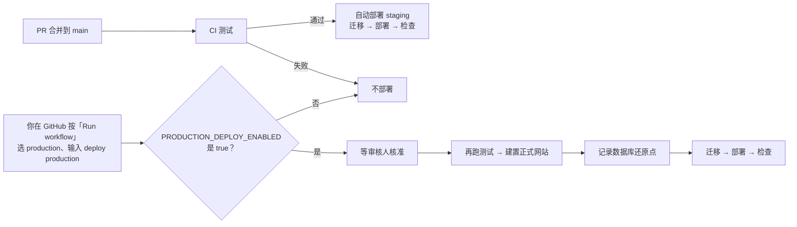

# 营运手册：部署、回退、还原、告警

| 项目 | 内容 |
|---|---|
| 范围 | 商店 Worker（`commerce/`）和它的数据库（D1）：staging 与正式环境 |
| 来源 | 阶段 3 计划 PR 3-1（`docs/design/phase3-plan.md` 4.1）；规格 M12 |
| 规则 | 只写名称，**不写任何密钥的值**。正式环境的设定有变动，同时更新 `docs/ops/production-config.md` |

---

## 1. 一页总览

| 要做的事 | 怎么做 | 谁 | 多久 |
|---|---|---|---|
| 部署 staging | `main` 更新、CI 通过后自动部署（第 3 节）；也可以在 GitHub 手动执行 | 自动 | 约 5 分钟 |
| 部署正式环境 | 只能在 GitHub 手动执行「Deploy」，并由审核人按核准（第 4 节）。**本机不部署正式环境** | 你核准 | 约 10 分钟 |
| 新版出问题，退回上一版 | `wrangler rollback`（第 5 节） | 工程 | 目标 10 分钟内 |
| 资料被改坏或误删 | D1 Time Travel 还原到指定时间（第 6 节） | 工程，你同意后 | 约 5 分钟，加上补资料的时间 |
| 新增数据库变更 | 新增一个编号迁移档，只增不改（第 7 节） | 工程 | — |
| 网站出错 | Workers Issues 收集错误（第 8 节） | 自动 | — |
| 排程停了 | 健康检查服务没收到心跳就寄信（第 9 节） | 自动 | 最慢 15 分钟内 |



---

## 2. 一次性设定（你要做的）

这些都在网页上操作，不需要指令。设定完告诉我，我帮你检查。

**谁能做**：第 2–5 项要 GitHub repo 拥有者帐号（WADEYEH）的管理权限，这台电脑登录的 GitHub 帐号（anpuuuuu）只有推送权限，不能改设定；第 1、6、8 项要能登录 Cloudflare 后台（帐号 wadeyeh@apgo.com.tw 的 Cloudflare）。权限还没拿到之前：staging 照旧从这台电脑部署，阶段 3 开发不受影响；**切换上线前一定要完成**，否则正式环境无法部署（依规则不从本机部署）。

| # | 在哪里 | 做什么 | 什么时候 |
|---|---|---|---|
| 1 | Cloudflare → My Profile → API Tokens → Create Token | 用「Edit Cloudflare Workers」范本，再加一项权限 **Account → D1 → Edit**；Account Resources 只选公司的帐号；名称例如 `github-deploy-shopapgo` | 现在 |
| 2 | GitHub → shopapgo → Settings → Secrets and variables → Actions → **Secrets** | 新增 `CLOUDFLARE_API_TOKEN`（上一步的金钥）和 `CLOUDFLARE_ACCOUNT_ID`（Cloudflare 首页右侧的 Account ID） | 现在 |
| 3 | GitHub → Settings → Environments → New environment | 名称 `production`；勾 **Required reviewers**，加你自己；Deployment branches 选 **Selected branches**，只加 `main` | 现在 |
| 4 | GitHub → Settings → Secrets and variables → Actions → **Variables** | `PRODUCTION_DEPLOY_ENABLED` 先**不要建**（或设 `false`）；切换上线那天才设 `true` | 切换时 |
| 5 | 同上 Variables | `APGO_US_ANALYTICS_READY`、`APGO_US_GTM_ID`、`APGO_US_META_PIXEL_ID`：正式网站的追踪设定（公开值，D40） | PR 3-9 时一起设 |
| 6 | healthchecks.io（免费方案即可）| 新增一个 check：Period 5 分钟、Grace 10 分钟，通知方式选你的 email；复制它的 Ping URL | 切换前 |
| 7 | 终端机（我可以帮你打指令，值由你贴上） | `npx wrangler secret put HEALTHCHECK_PING_URL --env production`，贴上第 6 步的 Ping URL。staging 要不要也设一个可以自己决定 | 切换前 |
| 8 | Cloudflare → Workers & Pages → `apgo-us-store` → Issues | 部署后自动开启，可以看到所有错误。要「主动通知」：Issues 的自动通知目前只能送到聊天工具或 webhook，不能直接寄 email；PR 3-7（团队通知）会加一个接收端，收到就寄团队信 | PR 3-7 |

金钥第 1 步的权限说明：「Edit Cloudflare Workers」范本可以部署 Worker、改路由；加上 D1 Edit 才能套用数据库迁移和查还原点。这个金钥只放在 GitHub 的 Secrets，不会出现在任何档案或纪录里。

没有设定第 1、2 步之前，CI 通过后的「Deploy」只会显示一行提示「没有设定金钥，所以没有部署」，不会失败也不会部署。

---

## 3. 部署 staging

**自动**：PR 合并到 `main` → CI 全部通过 → 「Deploy」工作自动部署**CI 测过的那个版本**：

1. 建置网站（测试设定：不载入任何追踪）
2. `wrangler d1 migrations apply DB --env staging --remote`：只套用还没套用过的迁移档
3. `wrangler deploy --env staging`
4. 检查 `https://staging.shopapgo.com/robots.txt` 有回应

**手动**：GitHub → Actions → Deploy → Run workflow → target 选 `staging`。

**从本机**（开发中测试用，staging 才可以）：

```bash
npm --prefix commerce run deploy:staging
```

staging 的特别设定：订单付款后会自动送到**假的 Amazon**（第 10 节），不会真的出货；顾客信只寄给白名单里的测试信箱。

---

## 4. 部署正式环境

**切换上线前不会执行**：`PRODUCTION_DEPLOY_ENABLED` 不是 `true` 时，这个工作直接跳过。

1. GitHub → Actions → Deploy → Run workflow，branch 选 `main`，target 选 `production`，confirm 输入 `deploy production`。
2. 审核人（你）收到 GitHub 通知，看过后按 **Approve and deploy**。
3. 工作依序执行，任何一步失败都会停下，后面的不会做：
   1. 商店和网站的测试
   2. 建置正式网站（`build-site.mjs --production`：追踪设定必须由 GitHub Variables 明确给值，开了追踪就要是正确的 GTM 和 Pixel ID，否则拒绝建置）
   3. 检查 Worker 能打包
   4. **记录数据库还原点**：`wrangler d1 time-travel info DB --env production --json`，结果写在这次执行的 Summary 页
   5. 套用迁移档
   6. 部署
   7. 检查 `https://www.shopapgo.com/api/store/config` 有回应
4. 部署后 30 分钟内看：Issues 有没有新错误、`/api/health` 是否 200、下一张订单是否正常。有问题照第 5 节回退。

---

## 5. 回退 Worker（新版出问题）

目标：**10 分钟内**回到上一版（M12-04、上线验收 G14）。回退只换程式，不动数据库；因为迁移只增不改（第 7 节），旧版程式在新的数据库结构上照样能跑。

1. 查版本（最新的在最上面）：
   ```bash
   cd commerce
   npx wrangler deployments list --env production
   ```
2. 退回上一版（不写版本号就是上一版；写版本号就退到那一版）：
   ```bash
   npx wrangler rollback --env production --message "回退：<原因>"
   npx wrangler rollback <版本号> --env production --message "回退：<原因>"
   ```
   加了 `--message` 就不会再问确认，按下去立刻生效。
3. 检查：`/api/store/config` 有回应、首页和结账页打得开、Issues 的错误停止增加。
4. 修好后照第 4 节重新部署（不要再 rollback 回新版，让 CI 部署修正后的版本）。

也可以在 Cloudflare 后台操作：Workers & Pages → `apgo-us-store` → Deployments → 版本右边的「⋯」→ Rollback。

**演练纪录（staging）**：见第 11 节。

---

## 6. 还原数据库（Time Travel）

D1 会自动保留过去每一分钟的状态（Workers 付费方案 **30 天**，免费方案 7 天），可以把整个数据库还原到这段时间里的任何一个时间点（M12-05、情境 J3）。

**注意：还原会把那个时间点之后的所有写入都拿掉**（包括之后的新订单、付款纪录）。正式环境还原前一定要：先跟你确认、先暂停会写入的东西、记下还原后要补回的资料。

1. 找时间点：出事前的时间（UTC），或部署时记在 Summary 页的还原点（bookmark）。
   ```bash
   cd commerce
   npx wrangler d1 time-travel info DB --env production --timestamp 2026-10-20T03:15:00Z
   ```
2. 先记下「现在」的还原点，万一还原错了可以再还原回来：
   ```bash
   npx wrangler d1 time-travel info DB --env production --json
   ```
3. 还原（指令会再问一次确认）：
   ```bash
   npx wrangler d1 time-travel restore DB --env production --bookmark <还原点>
   ```
   或用时间：`--timestamp 2026-10-20T03:15:00Z`。
4. 检查：订单数、最近几张订单的状态（只读查询）；`/api/health`。
5. 补回还原点之后发生、但应该保留的资料（例如付款服务那边成功的付款：付款服务会重送通知，或从后台付款查询补登）。

**演练纪录（staging）**：见第 11 节。

---

## 7. 数据库迁移（只增不改，D45）

- 迁移档放在 `commerce/migrations/`，档名 `0003_说明.sql`，编号连续。wrangler 在数据库里记录套用过哪些档（`d1_migrations` 资料表），每个档只套用一次。
- **只增不改**：可以新增资料表、索引、栏位；不删除、不改名、不改型别、不改既有资料。新栏位如果是 NOT NULL 一定要有预设值。
  - 理由：部署时会有一小段时间新旧两版程式同时在跑；回退时旧程式要能用新结构。只增不改，两边都不会坏。
- CI 自动检查（`commerce/tests/schema.test.mjs`）：每个档都符合规则；套用在正式数据库的实际结构上，原有栏位一个都没变。
- 真的需要删除或改名时：先用一个版本停止使用旧的，过一段时间确认没问题，再另外规划，并更新本节。
- 本机：`npm --prefix commerce run db:migrate:local`。staging：部署时自动。正式：只由 Deploy 工作套用。

| 档案 | 内容 |
|---|---|
| `0001_baseline.sql` | 原本 `worker/schema.sql` 的全部内容（建立所有既有资料表，已存在就不动） |
| `0002_operations.sql` | `cron_runs`（排程执行纪录，健康检查用）、`staging_fake_mcf_orders`（staging 假 Amazon 的订单） |

---

## 8. 错误告警（Workers Issues）

- `wrangler.toml` 三个环境都开了 `[observability.issues]`：未处理的错误、5xx 回应、错误等级的纪录都会被收集、分组。
- 看错误：Cloudflare → Workers & Pages → `apgo-us-store`（或 `-staging`）→ Issues。每个错误有发生次数、哪个版本、相关纪录。
- 主动通知：见第 2 节第 8 项（PR 3-7）。

---

## 9. 排程与健康检查

- 排程：正式环境**每 5 分钟**、staging 每 2 分钟。每次执行三件工作：Amazon 出货状态同步、顾客信重寄、Meta 事件重送。一件失败不影响其他件。
- 每次执行写进 `cron_runs` 资料表（`_tick` 代表整次执行），记录开始、结束、最后成功时间和最后的错误。
- `GET /api/health`：
  - 200 `{"ok":true,...}`：30 分钟内有执行完的排程
  - 503 `{"ok":false,...}`：超过 30 分钟没执行（或从来没执行过，例如刚部署好几分钟内）
  - 不含任何个人资料或错误内容，可以给监控服务检查。staging 在 Basic 登录后面。
- 心跳：设了 `HEALTHCHECK_PING_URL`（只接受 https）就每次执行完 ping 一次；有工作失败时 ping `…/fail`。healthchecks.io 在超过 Period + Grace 没收到心跳、或收到 fail 时寄信给你。

---

## 10. staging 的假 Amazon

Amazon 出货服务没有测试环境，staging 的订单如果真的送出去会真的出货。所以 staging 设了 `MCF_FAKE = "true"`：所有出货相关的呼叫都由 Worker 里的假服务回答（`commerce/worker/fake-amazon.js`），**完全不连到 Amazon**，资料存在 staging 数据库的 `staging_fake_mcf_orders`。

| 想测试 | 怎么做 | 结果 |
|---|---|---|
| 正常出货 | staging 照常下单付款 | 收到订单 → 2 分钟后「处理中」→ 10 分钟后「已出货」，有 Amazon Logistics 追踪号（`TBA9` 开头）；下一次排程同步后订单标成已出货、寄出货信（只寄白名单信箱） |
| 缺货 | 收件人姓名里有 `STOCKOUT`（例如姓氏填 STOCKOUT） | 2 分钟后 Amazon 回报「无法出货」（UNFULFILLABLE），后台显示送单被拒 |
| 出货快一点 | staging 的设定加 `FAKE_MCF_SHIP_MINUTES = "1"` 后重新部署 | 1 分钟后出货 |

安全设计：`MCF_FAKE` 只有在 `SITE_ENV = "staging"` 时才有效；如果有人在正式环境或本机设了它，**所有送单都停止**（不会改送真的 Amazon），后台显示原因。CI 检查正式环境的设定里没有 `MCF_FAKE`。

---

## 11. 演练纪录

| 日期 | 演练 | 环境 | 结果 | 花费时间 |
|---|---|---|---|---|
| 2026-10-09 | 第一次套用迁移档（PR 3-1 部署） | staging | `0001_baseline.sql` 没有改动既有的资料表（订单 23 张不变），`0002_operations.sql` 新增两张表；`d1_migrations` 记录 2 笔 | 部署全程约 3 分钟 |
| 2026-10-09 | 还原数据库（第 6 节） | staging | 记下还原点 → 建一张标记资料表（写 1 笔）→ 还原到还原点 → 标记资料表消失；订单 23 张、迁移纪录 2 笔都不变。还原指令同时回传「还原前」的还原点，必要时可以再还原回去 | 还原指令 5 秒；含前后检查约 1 分钟 |
| 2026-10-09 | 回退 Worker（第 5 节） | staging | 新版 `98d0ccf5` 退回上一版 `ff98a90d`：`deployments status` 显示上一版、网站有回应；再回到新版。旧版程式在新的数据库结构上正常（只增不改） | 回退含检查 17 秒；回到新版 15 秒（目标 10 分钟内：通过） |
| 2026-10-09 | 排程纪录（第 9 节） | staging | 部署后第一次排程（UTC 08:38）三个工作都成功；`cron_runs` 记下整次执行（`_tick`）和各工作的开始、结束、成功时间 | — |
